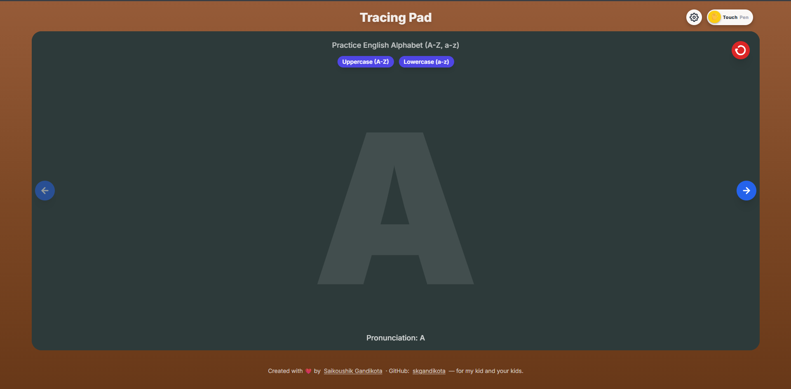

# TracingPad

> A free, kid-safe digital slate for tracing **Hindi · Telugu · English · Tamil** alphabets — with pen-aware chalk, glyph-masked tracing, and parental locks. **Installable as an app**.

🔗 **Live:** <https://tracingpad.github.io/>

---

## Why TracingPad?

I built this for my kid (and yours). It's a one-page, no-login, no-ads tool that helps young learners practice the shapes of letters in four languages on a tablet or laptop with a stylus or finger.

## Features

- **Four languages, complete alphabets** — Hindi (Varnamala), Telugu (Achulu / Hallulu), English (A–Z and a–z), Tamil
- **Pen-aware chalk** — variable stroke width from `pointerEvent.pressure` in Pen mode; smooth segments
- **Glyph-masked tracing** — chalk is clipped to the character outline so the kid stays in the lines (toggleable)
- **Touch ↔ Pen toggle** with palm rejection — finger drawing or stylus-only
- **Multi-character grid** — 1, 2, 4, 6, or All characters on screen
- **Parental locks everywhere** — long-press to flip input mode (10 s), open settings (3 s), open install dialog (3 s), or follow a footer link (10 s) — so a kid can't accidentally exit
- **Installable PWA** — fullscreen kiosk display, offline-capable (service worker), screen wake-lock to stop the tablet sleeping mid-practice
- **Accessible** — multiple character pages per screen for early learners; clear high-contrast slate

## How to use

1. Open <https://tracingpad.github.io/> on a tablet, laptop, or phone.
2. Long-press the ⚙ gear (3 s) to pick a language and other settings.
3. Trace the character on the slate; press **Clear** to reset.
4. Long-press the 📲 install row to add TracingPad to your home screen — it then launches fullscreen, no browser chrome.

For a true kid-locked experience use your OS lock:
- **Android:** Settings → Security → Screen Pinning
- **iOS / iPadOS:** Settings → Accessibility → Guided Access

## Tech

- Single-page vanilla JS — no build step, no framework, no tracking beyond Google Analytics
- Tailwind CSS via CDN, Inter font via Google Fonts
- HTML5 Canvas + Pointer Events
- Web App Manifest + Service Worker (cache-first app shell)
- schema.org JSON-LD for proper authorship attribution

## Author

Made with ❤️ by **Saikoushik Gandikota** for my kid — and yours.

- LinkedIn: <https://www.linkedin.com/in/saikoushikg/>
- GitHub: [@skgandikota](https://github.com/skgandikota)

## License

[MIT](LICENSE) — fork it, remix it, gift it to your kid's school.
